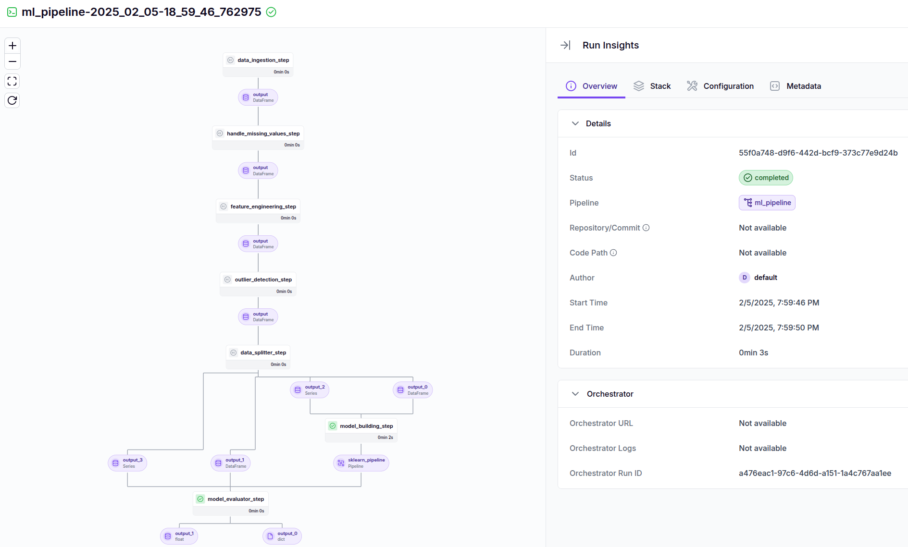

# House Price Prediction ML Project

This project implements a machine learning pipeline for predicting house prices using Python, MLflow, and ZenML. The system handles the complete ML lifecycle from data ingestion to model deployment and monitoring.

## 🎯 Features

- Automated ML pipeline for house price prediction
- Data preprocessing and feature engineering
- Outlier detection and handling
- Model training and evaluation
- Continuous deployment with MLflow
- Experiment tracking and model versioning

## 🏗️ Project Structure

```
├── analysis/            # Jupyter notebooks and analysis scripts
├── pipelines/          # ML pipeline definitions
│   └── training_pipeline.py
├── src/               # Source code and utilities
├── run_deployment.py  # Deployment script
└── README.md
```

## 🔧 Technologies Used

- **Python**: Primary programming language
- **MLflow**: Experiment tracking and model deployment
- **ZenML**: ML pipeline orchestration
- **Scikit-learn**: Model building and evaluation
- **Pandas/NumPy**: Data manipulation and analysis
- **Matplotlib/Seaborn**: Data visualization

## 🚀 Getting Started

### Prerequisites

- Python 3.8+
- pip package manager

### Installation

1. Clone the repository:
```bash
git clone [repository-url]
cd house-price-prediction
```

2. Create and activate a virtual environment:
```bash
python -m venv venv
source venv/bin/activate  # On Windows: venv\Scripts\activate
```

3. Install dependencies:
```bash
pip install -r requirements.txt
```

### Running the Pipeline

1. Execute the training pipeline:
```bash
python run_pipeline.py
```

2. Start the deployment:
```bash
python run_deployment.py
```

3. Access MLflow UI:
```bash
mlflow ui
```
Navigate to `http://localhost:5000` to view experiments.



## 📊 ML Pipeline Steps

1. **Data Ingestion**
   - Loads data from zip file
   - Performs initial data validation

2. **Data Preprocessing**
   - Handles missing values
   - Applies feature engineering
   - Performs outlier detection and removal

3. **Model Training**
   - Splits data into training and testing sets
   - Trains the predictive model
   - Evaluates model performance

4. **Deployment**
   - Deploys model using MLflow
   - Enables continuous deployment
   - Provides prediction service endpoints

## 🔍 Model Monitoring

The project includes model monitoring capabilities through MLflow, tracking:
- Model performance metrics
- Feature importance
- Training parameters
- Model versions
